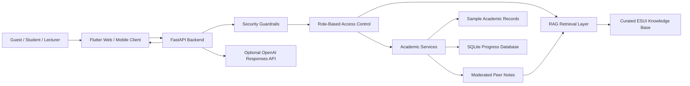
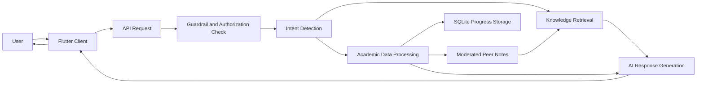
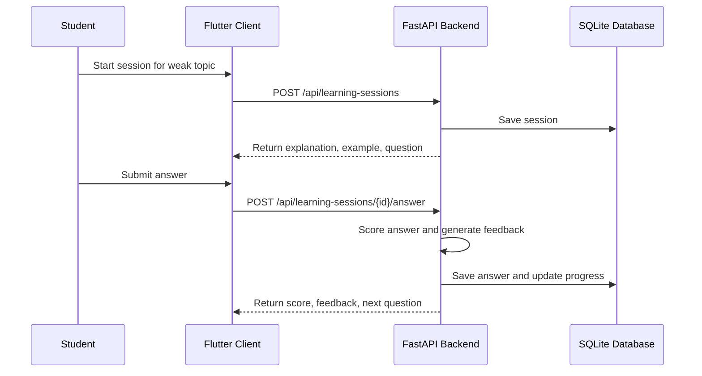
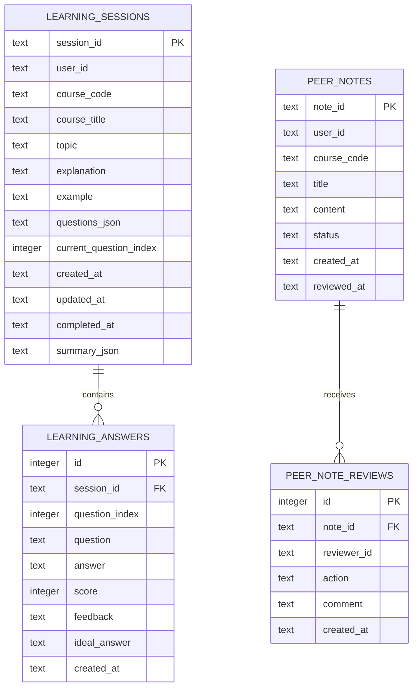

# CHAPTER THREE

# SYSTEM ANALYSIS AND DESIGN

## 3.1 Introduction to the Chapter

This chapter presents the analysis and design of the proposed system for the project topic: **Design and implementation of an ai system for personalized learning and academic progress tracking**. It describes the existing system, proposed system, functional and non-functional requirements, system architecture, use case design, database design, algorithmic design, tools and technologies, and ethical considerations.

The system is named Eve. Eve is designed as an institutional AI academic companion for Edo State University Iyamho. It supports prospective candidates, current students, and lecturers through role-based access, Retrieval-Augmented Generation, personalized learning sessions, academic progress tracking, lecturer course analytics, and cybersecurity guardrails.

## 3.2 Research Design / Project Approach

The project uses a design and implementation approach. This approach is suitable because the study is not only investigating a problem but also building a functional software solution. The development process followed an iterative prototyping model. In each iteration, a core module was designed, implemented, tested, and improved.

The major development iterations were:

- requirement analysis from the project description and university context;
- review of related AI systems used by universities;
- design of the role-based AI architecture;
- implementation of the FastAPI backend;
- implementation of the Flutter user interface;
- implementation of RAG, guardrails, and OpenAI response generation;
- implementation of personalized learning and saved progress tracking;
- implementation of lecturer analytics from saved learning-session data;
- testing of API endpoints, Flutter screens, and security behavior.

The iterative approach was selected because AI systems require continuous refinement. Chat responses, retrieval behavior, user interface design, and privacy controls must be tested with realistic user scenarios before they become dependable.

## 3.3 Analysis of Existing System

In the existing academic-support arrangement, students obtain information from separate sources such as the university website, physical offices, lecturers, course materials, student portals, and informal peer communication. This creates delays and inconsistency because the student may need to move across several platforms before receiving useful guidance.

For prospective candidates, admission information may be available online, but candidates still need guidance on requirements, readiness, application roadmap, and preparation for their preferred course. For current students, academic progress guidance is often not personalized enough. Students may know their scores but may not receive continuous guidance on weak topics, study planning, mock tests, or improvement strategies. For lecturers, course analytics may not be integrated with student learning activity in a way that supports fast teaching intervention.

Generic AI tools can answer questions, but they are not designed around Edo State University data, student privacy, lecturer authorization, or academic progress tracking. They may hallucinate policies, expose private information, or fail to ground responses in approved institutional knowledge.

## 3.4 Proposed System Overview

The proposed system, Eve, is an AI-powered academic support platform for Edo State University Iyamho. It provides personalized learning and academic progress tracking through three major user modes:

- Guest Mode: for prospective candidates and public users.
- Student Mode: for current students who need personalized academic support.
- Lecturer Mode: for academic staff who need assigned-course analytics.

Eve combines structured academic data, curated university knowledge, RAG, cybersecurity guardrails, optional OpenAI response generation, and a responsive Flutter interface.

The major modules are:

- user role selection and account switching;
- AI chat assistant;
- RAG knowledge retrieval;
- prompt-injection and privacy guardrails;
- admissions readiness estimator;
- student learning profile;
- guided learning sessions;
- quiz scoring and feedback;
- SQLite progress persistence;
- lecturer assigned-course analytics;
- upload-assisted Ask Eve questions;
- moderated peer-note submissions;
- lecturer and admin review workflow;
- defense-ready audit and explainability labels.

## 3.5 System Requirements

### 3.5.1 Functional Requirements

The system should:

- allow users to enter as guest, student, or lecturer;
- answer general ESUI questions using curated knowledge;
- estimate admission readiness using JAMB score and O-Level grades;
- provide students with personalized academic progress information;
- identify weak courses and weak topics;
- recommend weekly study tasks;
- start guided learning sessions for registered student courses;
- explain selected topics and provide worked examples;
- score student quiz answers and provide feedback;
- persist learning sessions, answers, scores, and completion status;
- show saved student progress history;
- allow students to upload notes for private question context;
- allow students to submit course notes for review;
- allow lecturers to review peer notes only for assigned courses;
- allow administrators to manage wider knowledge-base entries;
- provide lecturers with analytics for assigned courses only;
- show lecturer trends from saved learning sessions;
- block prompt-injection attempts and unauthorized private-record requests;
- show audit information such as response mode and retrieved sources.

### 3.5.2 Non-Functional Requirements

The system should:

- be responsive on desktop and mobile screens;
- protect private student and lecturer data through role-based access;
- provide understandable and useful responses;
- remain usable when OpenAI mode is unavailable by falling back to local logic;
- run locally for defense demonstration;
- use maintainable modular backend code;
- avoid exposing API keys or hidden system instructions;
- provide clear testable API endpoints.

### 3.5.3 Hardware Requirements

- Laptop or desktop computer.
- Minimum 8GB RAM recommended.
- Internet connection when OpenAI response generation is enabled.
- Android device or browser for user testing.

### 3.5.4 Software Requirements

- Windows operating system.
- Flutter SDK.
- Python 3.
- FastAPI backend.
- Uvicorn ASGI server.
- SQLite database.
- Browser for Flutter web demonstration.
- Optional OpenAI API key.

## 3.6 Data Collection Methods

The prototype uses the following data sources:

- project requirement description supplied by the student;
- curated public information from Edo State University web resources and approved institutional documents;
- sample student records for demonstration;
- sample lecturer course analytics;
- sample ESUI knowledge base entries;
- related work on RAG, AI risk management, LLMs, and university AI platforms from 2020 onward.

The sample records are not live university records. They are used only to demonstrate system behavior, role separation, and academic progress tracking. In a production deployment, the primary knowledge source should be an approved ESUI knowledge base maintained by designated university data owners, while the public website should remain a supplementary source for current announcements and public-facing updates.

## 3.7 Population and Sampling

The intended population includes prospective candidates, current students, lecturers, and university support staff. For prototype demonstration, purposive sampling was used. Demo accounts were created to represent:

- one guest user;
- two student users;
- two lecturer users.

This sampling approach is acceptable for a system-development project because the focus is on demonstrating functionality rather than conducting a statistical survey.

## 3.8 System Architecture / Design

The system uses a client-server architecture. The Flutter client handles the user interface, while the FastAPI backend handles AI orchestration, retrieval, guardrails, academic logic, progress storage, and external AI calls.



### 3.8.1 Backend Layer

The backend is implemented with FastAPI. It exposes REST endpoints for users, chat, admissions estimation, student learning profile, learning sessions, progress history, lecturer insights, file-assisted questions, peer-note submission, and moderation review.

### 3.8.2 AI Orchestration Layer

The AI layer detects user intent, checks authorization, retrieves relevant knowledge, prepares authorized private context, and generates an answer. When OpenAI is configured, Eve uses the OpenAI Responses API. When OpenAI is unavailable, Eve uses deterministic local fallback responses.

### 3.8.3 Data Layer

The prototype uses JSON files for sample users, sample academic records, and curated knowledge. It uses SQLite for saved learning sessions, progress tracking, and moderated peer-note records.

## 3.9 Use Case / UML Diagrams

### 3.9.1 Use Case Diagram

```mermaid
flowchart TB
    Guest["Guest User"]
    Student["Student"]
    Lecturer["Lecturer"]
    Eve["Eve AI System"]

    Guest --> UC1["Ask public ESUI questions"]
    Guest --> UC2["Estimate admission readiness"]
    Guest --> UC3["View admission roadmap"]

    Student --> UC4["Ask academic questions"]
    Student --> UC5["View learning progress"]
    Student --> UC6["Start guided learning session"]
    Student --> UC7["Submit quiz answers"]
    Student --> UC8["View saved progress history"]
    Student --> UC9["Ask fee or timetable guidance"]
    Student --> UC10["Upload private notes for Ask Eve"]
    Student --> UC11["Submit peer learning notes"]

    Lecturer --> UC12["View assigned-course analytics"]
    Lecturer --> UC13["View saved session trends"]
    Lecturer --> UC14["Request teaching interventions"]
    Lecturer --> UC15["Review assigned-course peer notes"]

    UC1 --> Eve
    UC2 --> Eve
    UC3 --> Eve
    UC4 --> Eve
    UC5 --> Eve
    UC6 --> Eve
    UC7 --> Eve
    UC8 --> Eve
    UC9 --> Eve
    UC10 --> Eve
    UC11 --> Eve
    UC12 --> Eve
    UC13 --> Eve
    UC14 --> Eve
    UC15 --> Eve
```



### 3.9.2 Data Flow Diagram



### 3.9.3 Learning Session Sequence



## 3.10 Database Design

SQLite is used for local persistence of learning-session history and moderated peer-note activity. This makes the prototype suitable for defense because progress and contribution records survive backend restarts without requiring an external database server.

### 3.10.1 Entity Relationship Diagram



### 3.10.2 Table Description

| Table | Purpose |
| --- | --- |
| `learning_sessions` | Stores each guided learning session, course, topic, progress counter, timestamps, and summary. |
| `learning_answers` | Stores student submitted answers, scores, feedback, ideal answer direction, and timestamps. |
| `peer_notes` | Stores student course-note submissions and moderation status. |
| `peer_note_reviews` | Stores lecturer or admin review actions for submitted notes. |

The JSON sample records store demo users, student profiles, lecturer profiles, and course analytics. The SQLite database stores runtime progress history and peer-note moderation records.

## 3.11 Algorithm / Model Design

### 3.11.1 Intent Detection Algorithm

The system classifies messages into intents such as greeting, admission, exam practice, student success, fees, planning, lecturer analytics, and general knowledge. This helps Eve decide which service or retrieval path should handle the request.

### 3.11.2 RAG Algorithm

The retrieval process tokenizes the user query and compares it with curated ESUI knowledge entries. Relevant entries are returned as sources. This reduces hallucination by grounding answers in approved context.

```text
Input: user message, user role
1. Tokenize message.
2. Filter knowledge entries by allowed audience.
3. Score each entry using token overlap similarity.
4. Rank entries by score.
5. Return top relevant entries.
```

### 3.11.3 Learning Progress Algorithm

Course progress is calculated using continuous assessment score, risk level, and weak-topic count. Saved quiz averages are then used as an additional signal.

```text
course_progress = CA score + risk_bonus - topic_gap_penalty
overall_progress = weighted average of course progress and saved quiz performance
```

### 3.11.4 Quiz Scoring Algorithm

Each quiz question has expected keywords and an ideal answer. The system checks whether the student answer includes core concepts, then assigns a score and feedback.

```text
1. Normalize student answer.
2. Match expected keywords.
3. Calculate match ratio.
4. Add explanation-length bonus when appropriate.
5. Return score, feedback, and ideal direction.
```

### 3.11.5 Guardrail Algorithm

Before retrieval or answer generation, suspicious prompts are checked. Requests that attempt to reveal hidden prompts, bypass authorization, dump records, or access another user's private data are blocked.

## 3.12 Tools and Technologies

| Tool | Purpose |
| --- | --- |
| Flutter | Cross-platform client interface for Web and future Android deployment. |
| Python | Backend language suitable for AI, data processing, and RAG workflows. |
| FastAPI | REST API backend framework. |
| SQLite | Local database for saved learning-session progress. |
| OpenAI Responses API | Optional ChatGPT-style response generation. |
| JSON | Prototype knowledge and sample academic records. |
| PowerShell | Local development and testing commands. |

Flutter was selected because the product vision includes a downloadable mobile app and responsive web demonstration. Python FastAPI was selected because Python has strong support for AI, retrieval, data processing, and future machine-learning extensions.

## 3.13 Ethical Considerations

The system handles academic and personal data; therefore, privacy and responsible AI behavior are important. The prototype uses sample records, but a production system would require official data approval, authentication, consent, audit logs, and institutional governance.

Key ethical considerations include:

- protecting student academic records;
- limiting lecturers to assigned-course analytics;
- avoiding false admission guarantees;
- showing uncertainty when official context is insufficient;
- blocking prompt injection and private-record extraction;
- keeping API keys outside the application code;
- documenting AI use honestly.

## 3.14 Summary of the Chapter

This chapter described the system analysis and design of Eve. It presented the existing system, proposed architecture, requirements, use cases, database structure, algorithms, technology choices, and ethical considerations. The design supports the main goal of the project by combining personalized learning, academic progress tracking, role-based access, RAG, guardrails, and saved progress history.
