# DESIGN AND IMPLEMENTATION OF AN AI SYSTEM FOR PERSONALIZED LEARNING AND ACADEMIC PROGRESS TRACKING

BY

NAME OF STUDENT

MATRICULATION NUMBER

DEPARTMENT OF COMPUTER SCIENCE

FACULTY OF SCIENCE

EDO STATE UNIVERSITY, IYAMHO,

EDO STATE

JUNE, 2026

# DESIGN AND IMPLEMENTATION OF AN AI SYSTEM FOR PERSONALIZED LEARNING AND ACADEMIC PROGRESS TRACKING

BY

SURNAME, OTHER NAMES

MATRICULATION NUMBER

A PROJECT SUBMITTED IN PARTIAL FULFILLMENT OF THE REQUIREMENTS FOR THE AWARD OF THE DEGREE OF BACHELOR OF SCIENCE (B.Sc.) IN COMPUTER SCIENCE, EDO STATE UNIVERSITY, IYAMHO

JUNE, 2026

# DECLARATION

This project is my original work and has not been presented for a degree at any other university or similar institution. I also declare that I have not taken any material from any source without proper acknowledgement, and no part of this project may be reproduced without the prior written permission of the author and/or Edo State University, Iyamho.

Name of Student: ______________________________

Matriculation Number: _________________________

Date: ________________________________________

# CERTIFICATION

This is to certify that NAME OF STUDENT with Matriculation Number: MATRICULATION NUMBER undertook this project titled: Design and implementation of an ai system for personalized learning and academic progress tracking, and that it meets the requirements for submission to the Department of Computer Science, Edo State University Iyamho, in partial fulfillment for the award of the degree of Bachelor of Science (B.Sc.) in Computer Science.

Project Supervisor: ___________________________

Signature: __________________ Date: ___________

Lecturer-in-Charge: ___________________________

Signature: __________________ Date: ___________

External Examiner: ____________________________

Signature: __________________ Date: ___________

# DEDICATION

This project is dedicated to God Almighty, whose grace, strength, and guidance made the successful completion of this work possible.

# ACKNOWLEDGEMENT

I acknowledge God Almighty for wisdom, strength, and protection throughout this project. I also appreciate my supervisor, lecturers in the Department of Computer Science, my family, and everyone whose support contributed to the successful completion of this work.

# ABSTRACT

This project focused on the design and implementation of an AI system for personalized learning and academic progress tracking. The system, named Eve, was developed as a role-aware academic companion for Edo State University Iyamho. It supports guest users, students, and lecturers through a responsive Flutter interface connected to a Python FastAPI backend. The system provides admission guidance, student learning progress tracking, guided learning sessions, quiz scoring, saved progress history, upload-assisted questions, moderated peer notes, lecturer assigned-course analytics, Retrieval-Augmented Generation, prompt-injection guardrails, knowledge governance, and optional OpenAI response generation. SQLite was used to persist learning sessions, answers, scores, feedback, completion status, and peer-note review records. The system was evaluated using backend compilation, Flutter analysis, widget tests, API endpoint tests, learning-session persistence checks, lecturer analytics checks, moderation checks, and security behavior tests. The results showed that Eve can support personalized academic guidance, track student progress over time, manage reviewed student contributions, and provide lecturers with course-level learning evidence while enforcing role-based privacy controls.

# TABLE OF CONTENTS

CHAPTER ONE

INTRODUCTION

1.1 Background to the Study

1.2 Statement of the Problem

1.3 Aim of the Study

1.4 Objectives of the Study

1.5 Research Questions

1.6 Research Hypotheses

1.7 Significance of the Study

1.8 Scope of the Study

1.9 Limitations of the Study

1.10 Definition of Terms

1.11 Organisation of the Report

CHAPTER TWO

LITERATURE REVIEW

CHAPTER THREE

SYSTEM ANALYSIS AND DESIGN

CHAPTER FOUR

IMPLEMENTATION

CHAPTER FIVE

SUMMARY, CONCLUSION AND RECOMMENDATIONS

REFERENCES

# LIST OF FIGURES

Figure 3.1 Architecture of the existing system

Figure 3.2 Architecture of the proposed Eve system

Figure 3.3 Data flow diagram

Figure 3.4 Database and storage design

Figure 4.1 Entry screen

Figure 4.2 Personalized student dashboard

Figure 4.3 Mobile responsive dashboard

Figure 4.4 Ask Eve conversation

Figure 4.5 Upload-assisted Ask Eve

Figure 4.6 Guided learning session

Figure 4.7 Peer-note submission

Figure 4.8 Lecturer peer-note review

Figure 4.9 Lecturer analytics

Figure 4.10 Admission readiness estimator

Figure 4.11 Admin knowledge library

Figure 4.12 Backend health endpoint


# CHAPTER ONE

# INTRODUCTION

## 1.1 Background to the Study

Universities increasingly rely on digital platforms to support teaching, learning, administration, academic advising, and student success. Edo State University Iyamho already provides digital services such as online admissions information, student-facing web resources, and Canvas LMS-supported learning. However, students still need a more unified, intelligent, and always-available system that can support personalized learning, monitor academic progress, identify weak areas, and provide guidance based on their academic needs.

Artificial intelligence systems can support personalized learning by explaining topics, generating practice questions, recommending study plans, and tracking academic performance indicators such as course scores, weak topics, fee status, and timetable commitments. When supported by Retrieval-Augmented Generation, role-based access control, and cybersecurity guardrails, such a system can provide useful academic support while protecting private student records.

This project proposes Eve, an AI system for personalized learning and academic progress tracking at Edo State University Iyamho. Eve is designed to support student academic guidance, weak-topic identification, mock assessment generation, progress monitoring, timetable planning, and lecturer course-progress analytics. The system also includes prompt-injection detection, privacy enforcement, and audit labels to reduce the risk of unauthorized data disclosure.

## 1.2 Statement of the Problem

Current students need academic guidance, timetable planning, course explanations, practice questions, fee-status guidance, and support based on their academic records. Lecturers also need insight into student performance for their assigned courses so they can identify weak topics and improve teaching strategies. In many institutions, this information is spread across websites, portals, offices, course materials, and informal communication channels.

Generic AI chatbots can answer questions, but they may hallucinate, expose private data if poorly designed, or fail to follow institutional policies. Therefore, Edo State University needs a role-aware AI system that supports personalized learning and academic progress tracking while retrieving from verified school knowledge, limiting users to authorized data, and blocking prompt-injection attempts.

## 1.3 Aim of the Study

The aim of this study is to design and implement an ai system for personalized learning and academic progress tracking.

## 1.4 Objectives of the Study

- To design a responsive AI system interface for personalized learning and academic progress tracking.
- To implement personalized academic support for students using course records, weak-topic analysis, and timetable data.
- To implement academic progress tracking using CGPA, course scores, risk levels, and study recommendations.
- To generate personalized learning plans, priority-course recommendations, and academic progress milestones.
- To implement a Retrieval-Augmented Generation workflow using curated ESUI knowledge.
- To implement role-based access control for public, student, and lecturer information.
- To add guardrails against prompt injection and unauthorized private-record access.
- To provide student academic advising, mock assessment generation, and fee guidance.
- To provide lecturer analytics for assigned courses.
- To include admission readiness guidance as an additional public-support feature.
- To evaluate the system using representative user scenarios and security tests.

## 1.5 Research Questions

The study is guided by the following research questions:

- How can an AI system be designed to support personalized learning and academic progress tracking for students?
- How can student weak topics and learning progress be identified and presented in a useful way?
- How can lecturers receive assigned-course analytics without exposing unauthorized student information?
- How can RAG and role-based access control reduce unsupported answers and privacy risks?
- How can the system remain useful for demonstration while using sample academic records instead of live university data?

## 1.6 Research Hypotheses

This project is a design and implementation study; therefore, formal statistical hypotheses are not required. The work is evaluated through system functionality, user scenarios, API tests, interface review, and security behavior checks rather than hypothesis testing.

## 1.7 Significance of the Study

The project is significant to students, lecturers, prospective candidates, and the university administration. Students can receive personalized academic support, practice assistance, weak-topic guidance, and progress tracking. Lecturers can access course-specific analytics for teaching improvement. Candidates can receive faster admission guidance as a supporting feature. The university can use the system as a foundation for a future institutional AI platform that improves academic support while protecting privacy.

## 1.8 Scope of the Study

The scope covers a prototype AI system for personalized learning and academic progress tracking at Edo State University Iyamho with guest, student, and lecturer modes. The prototype uses curated public ESUI knowledge and sample academic records. It demonstrates personalized student advising, weak-topic identification, saved learning-session progress, quiz scoring, mock assessment generation, lecturer analytics, admission guidance, RAG retrieval, prompt-injection blocking, and responsive Flutter-based user interaction.

## 1.9 Limitations of the Study

The prototype does not connect to live ESUI student databases, payment systems, or Canvas LMS. It uses sample data for demonstration, local SQLite storage for learning-session history, and optional OpenAI response generation when an API key is configured. In production, official data access approval, identity integration, server infrastructure, managed database deployment, and continuous content review would be required.

## 1.10 Definition of Terms

Artificial Intelligence: The use of computer systems to perform tasks that normally require human intelligence, such as answering questions, generating explanations, and recommending study plans.

Personalized Learning: A learning approach where academic support is adapted to the needs, weaknesses, and progress of each student.

Academic Progress Tracking: The monitoring of student learning performance using indicators such as course scores, weak topics, quiz results, completed sessions, and feedback history.

Retrieval-Augmented Generation: An AI approach where relevant information is retrieved from a knowledge base before an answer is generated.

Role-Based Access Control: A security method that limits what a user can see or do based on their role, such as guest, student, lecturer, or administrator.

Prompt Injection: An attempt to manipulate an AI system into ignoring its rules, revealing hidden instructions, or exposing private data.

## 1.11 Organisation of the Report

Chapter One introduces the study, problem statement, aim, objectives, significance, scope, limitations, and key terms. Chapter Two reviews related literature, existing AI systems, standards, algorithms, and datasets. Chapter Three presents the system analysis and design. Chapter Four describes implementation, screenshots, tests, and evaluation results. Chapter Five presents the summary, conclusion, recommendations, future work, and AI-use disclosure.

# CHAPTER TWO

# LITERATURE REVIEW

## 2.1 Introduction to the Chapter

This chapter reviews literature related to the project topic: **Design and implementation of an ai system for personalized learning and academic progress tracking**. The review covers the major concepts, theoretical framework, empirical related works, existing systems, comparative analysis, research gap, relevant algorithms, standards, and datasets.

The chapter focuses on artificial intelligence in education, personalized learning, academic progress tracking, Retrieval-Augmented Generation, large language models, cybersecurity guardrails, and institutional AI adoption in universities.

## 2.2 Conceptual Review

### 2.2.1 Artificial Intelligence in Education

Artificial intelligence in education refers to the use of intelligent computer systems to support teaching, learning, assessment, administration, and student services. AI systems can assist students by explaining difficult topics, generating practice questions, recommending learning resources, and providing feedback. For lecturers, AI can support course analytics, weak-topic detection, assessment preparation, and teaching intervention.

In this project, AI is used to provide academic guidance through Eve, an academic companion for Edo State University Iyamho. Eve supports students, prospective candidates, and lecturers through role-specific functions.

### 2.2.2 Personalized Learning

Personalized learning is an approach in which learning support is adapted to the needs, weaknesses, goals, and progress of each student. Instead of giving every student the same guidance, a personalized system considers the student's course records, weak topics, timetable, risk level, and learning history.

For this project, personalization is achieved by analyzing student continuous assessment scores, risk levels, weak topics, saved quiz scores, and completed learning sessions. The system then recommends priority courses, study plans, and guided learning sessions.

### 2.2.3 Academic Progress Tracking

Academic progress tracking involves monitoring student learning performance over time. It may include scores, CGPA, weak topics, completed tasks, quiz attempts, feedback history, and intervention records. Academic progress tracking helps students know where they stand and helps lecturers identify where support is needed.

In Eve, academic progress is tracked using course records and saved learning-session history. The SQLite database stores learning sessions, student answers, scores, feedback, and completion status.

### 2.2.4 Large Language Models

Large language models are AI models trained on large text datasets to understand and generate natural language. They can support explanation, summarization, question answering, and tutoring. However, LLMs may hallucinate or produce unsafe responses if not constrained. Zhao et al. (2023) explain that LLMs have strong language capabilities but require careful alignment, safety controls, and domain grounding.

In this project, OpenAI response generation is optional. The system uses local fallback logic when no API key is configured. This ensures that Eve remains functional even without external AI access.

### 2.2.5 Retrieval-Augmented Generation

Retrieval-Augmented Generation combines information retrieval with language generation. Instead of relying only on model memory, the system retrieves relevant documents and uses them to ground the response. Lewis et al. (2020) introduced RAG as a method for improving knowledge-intensive natural language processing tasks. Gao et al. (2024) further reviewed RAG as a major approach for improving LLM factuality and domain relevance.

Eve uses a curated ESUI knowledge base for retrieval. This helps prevent unsupported answers about university policies, admissions, learning resources, and institutional information.

### 2.2.6 Cybersecurity Guardrails

Cybersecurity guardrails are rules and checks that protect an AI system from unsafe use. In LLM applications, prompt injection is a major threat. It occurs when a user tries to override system instructions, reveal hidden prompts, bypass authentication, or extract private data. OWASP (2025) identifies prompt injection and sensitive-information disclosure as major LLM application risks.

Eve implements a guardrail layer that checks requests before retrieval and answer generation. Suspicious or unauthorized requests are blocked.

### 2.2.7 Role-Based Access Control

Role-based access control restricts user access according to assigned roles. In Eve, the main roles are guest, student, and lecturer. Guests can access public guidance only. Students can access their own academic and fee-related sample records. Lecturers can access analytics only for assigned courses.

This design helps protect private academic data and supports institutional governance.

## 2.3 Theoretical Framework

The theoretical foundation of this project is based on constructivist learning theory, adaptive learning theory, and information retrieval theory.

### 2.3.1 Constructivist Learning Theory

Constructivism suggests that students learn better when they actively build understanding through explanation, practice, and feedback. Eve supports this by explaining topics, asking questions, scoring student answers, and providing feedback.

### 2.3.2 Adaptive Learning Theory

Adaptive learning systems adjust content and recommendations based on learner performance. Eve applies this concept by identifying weak topics, selecting priority courses, recommending study plans, and using saved quiz performance to update progress indicators.

### 2.3.3 Information Retrieval Theory

Information retrieval theory focuses on finding relevant information from a document collection. Eve uses retrieval principles to search curated ESUI knowledge and return relevant context for AI responses.

### 2.3.4 AI Risk Management

The NIST AI Risk Management Framework (2023) emphasizes governance, mapping, measuring, and managing AI risks. This supports Eve's use of role-based access, audit labels, source grounding, and guardrails.

## 2.4 Empirical Review of Related Works

### 2.4.1 Retrieval-Augmented Generation

Lewis et al. (2020) proposed Retrieval-Augmented Generation for knowledge-intensive NLP tasks. Their work showed that retrieval can improve generated responses by grounding them in external documents. This is relevant to Eve because university information changes and should be grounded in approved sources.

### 2.4.2 Survey of Large Language Models

Zhao et al. (2023) reviewed large language models and discussed their capabilities, limitations, and applications. The study supports the use of LLMs for natural language interaction while also highlighting the need for safety and domain adaptation.

### 2.4.3 RAG for Large Language Models

Gao et al. (2024) reviewed RAG systems and explained how retrieval can improve factuality, trustworthiness, and domain-specific performance. Eve adopts this approach by retrieving from a curated ESUI knowledge base before generating responses.

### 2.4.4 AI Risk Management Framework

The National Institute of Standards and Technology (2023) published the AI Risk Management Framework. The framework emphasizes trustworthy AI through governance, risk mapping, measurement, and management. Eve reflects this by including privacy controls, security checks, role-based access, and audit information.

### 2.4.5 OWASP LLM Application Risks

OWASP Foundation (2025) identified common risks in LLM applications, including prompt injection, sensitive-information disclosure, insecure output handling, and excessive agency. Eve addresses these risks through prompt-injection detection, private-record restrictions, and source-limited responses.

## 2.5 Review of Existing Systems/Tools

### 2.5.1 Arizona State University AI Systems

Arizona State University provides ChatGPT Edu and institutional AI services. The ASU example shows that universities are adopting AI tools with governance and privacy considerations. The lesson for Eve is that an institutional AI system should have approved data sources, secure access, and clear boundaries.

### 2.5.2 University of Michigan AI Services

The University of Michigan provides AI services such as U-M GPT, Maizey, and mobile AI support. Maizey allows custom datasets, which is relevant to Eve's RAG approach. The lesson is that a university AI system should support controlled datasets, feedback, accessibility, and future data integration.

### 2.5.3 Georgia State University Pounce

Georgia State University has used Pounce-related chatbot systems for student success support. A 2022 report linked course-related chatbot support with improved student performance. The lesson for Eve is that AI can support academic outcomes when it provides targeted nudges, reminders, and learning guidance.

### 2.5.4 University of Houston Shasta

The University of Houston's Shasta chatbot provides departmental website-based assistance. It shows the value of departmental content ownership and service oversight. Eve can adopt this concept by allowing future ESUI departments to manage approved knowledge content.

### 2.5.5 University of Alaska Fairbanks Ocelot Chatbot

The University of Alaska Fairbanks launched an Ocelot chatbot with preloaded office information, generative search over university pages, and planned integration with student systems. This supports Eve's phased roadmap from public information support to deeper student-record integration.

## 2.6 Comparative Analysis of Related Works

| System / Study | Main Focus | Strength | Limitation / Gap | Relevance to Eve |
| --- | --- | --- | --- | --- |
| Lewis et al. (2020) RAG | Retrieval plus generation | Improves factual grounding | Not university-specific | Supports Eve's RAG design |
| Zhao et al. (2023) LLM survey | LLM capabilities and limitations | Broad AI language review | Does not implement ESUI system | Supports OpenAI response layer |
| Gao et al. (2024) RAG survey | RAG architecture and applications | Explains modern RAG patterns | Not focused on academic progress tracking | Supports retrieval design |
| NIST AI RMF (2023) | AI governance and risk | Strong risk-management framework | General framework, not a product | Supports guardrails and governance |
| OWASP LLM Top 10 (2025) | LLM security risks | Practical threat categories | Does not provide university app | Supports prompt-injection controls |
| ASU AI systems | Institutional AI adoption | Governance and privacy focus | Not tailored to ESUI | Supports institutional AI model |
| University of Michigan AI services | Custom datasets and campus AI | Controlled university datasets | Not directly for ESUI students | Supports future dataset expansion |
| Georgia State Pounce | Student success chatbot | Evidence of academic support impact | Different institutional setting | Supports proactive learning support |
| University of Houston Shasta | Departmental chatbot | Departmental content ownership | Mainly service Q&A | Supports departmental knowledge governance |
| UAF Ocelot | Campus support chatbot | Preloaded knowledge and future integration | Not focused on personalized learning | Supports phased deployment roadmap |

## 2.7 Identified Research Gap

The reviewed systems show that AI assistants are increasingly used in universities. However, many systems focus mainly on general information, chatbot support, or institutional AI access. The identified gap is the need for a system that combines:

- ESUI-focused public knowledge;
- personalized student learning support;
- academic progress tracking;
- guided learning sessions;
- saved quiz scores and feedback history;
- lecturer assigned-course analytics;
- RAG grounding;
- prompt-injection guardrails;
- role-based privacy protection.

This project addresses the gap by designing and implementing Eve as a role-aware AI system for personalized learning and academic progress tracking.

## 2.8 Summary of the Chapter

This chapter reviewed the main concepts and related works relevant to the project. It discussed AI in education, personalized learning, academic progress tracking, LLMs, RAG, cybersecurity guardrails, role-based access, and university AI systems. The review showed that existing AI systems provide useful lessons but do not fully address the ESUI-specific need for personalized learning and progress tracking with role-aware privacy controls.

## 2.9 Review of Relevant Algorithms

### 2.9.1 Retrieval Algorithm

The retrieval algorithm searches the curated ESUI knowledge base and returns relevant documents based on the user's message and role. It filters documents by audience before scoring them.

### 2.9.2 Intent Detection Algorithm

Intent detection classifies messages into categories such as admission, exam practice, student success, fees, planning, lecturer analytics, and knowledge. This allows the backend to route requests correctly.

### 2.9.3 Learning Progress Algorithm

The learning progress algorithm calculates course progress using continuous assessment score, risk level, topic gaps, and saved session performance. It then identifies the priority course and recommends study actions.

### 2.9.4 Quiz Scoring Algorithm

The quiz scoring algorithm compares student answers with expected keywords and ideal answer direction. It returns a score, feedback, and next step.

### 2.9.5 Guardrail Algorithm

The guardrail algorithm checks whether a prompt attempts to bypass rules, reveal private records, expose hidden instructions, or access unauthorized data.

## 2.10 Review of Relevant Standards/Protocols

### 2.10.1 NIST AI Risk Management Framework

The NIST AI RMF provides guidance for trustworthy AI risk management. It supports the design of Eve's governance, transparency, and privacy controls.

### 2.10.2 ISO/IEC 42001:2023

ISO/IEC 42001:2023 provides requirements for an AI management system. It is relevant to future institutional deployment because it emphasizes governance, monitoring, accountability, and continuous improvement.

### 2.10.3 OWASP Top 10 for LLM Applications

OWASP provides security guidance for LLM applications. Eve applies this by blocking prompt injection and restricting private-data access.

### 2.10.4 REST API Communication

Eve uses REST API endpoints between the Flutter client and FastAPI backend. REST allows the client to request chat responses, learning profiles, learning sessions, progress history, admissions estimates, and lecturer insights.

## 2.11 Review of Relevant Datasets

The prototype uses curated and sample datasets rather than live institutional records.

| Dataset | Purpose |
| --- | --- |
| ESUI knowledge base | Stores curated public and role-aware university knowledge. |
| Sample student records | Demonstrates student academic progress tracking. |
| Sample lecturer records | Demonstrates assigned-course analytics. |
| Sample course analytics | Demonstrates lecturer performance insights. |
| SQLite learning-session history | Stores runtime quiz attempts, scores, feedback, and progress history. |

In production, these datasets should be replaced or extended with approved ESUI systems such as student information systems, LMS materials, admissions data, and lecturer-approved course content.

# CHAPTER THREE

# SYSTEM ANALYSIS AND DESIGN

## 3.1 Introduction to the Chapter

This chapter presents the analysis and design of the proposed system for the project topic: **Design and implementation of an ai system for personalized learning and academic progress tracking**. It describes the existing system, proposed system, functional and non-functional requirements, system architecture, use case design, database design, algorithmic design, tools and technologies, and ethical considerations.

The system is named Eve. Eve is designed as an institutional AI academic companion for Edo State University Iyamho. It supports prospective candidates, current students, and lecturers through role-based access, Retrieval-Augmented Generation, personalized learning sessions, academic progress tracking, lecturer course analytics, and cybersecurity guardrails.

## 3.2 Research Design / Project Approach

The project uses a design and implementation approach. This approach is suitable because the study is not only investigating a problem but also building a functional software solution. The development process followed an iterative prototyping model. In each iteration, a core module was designed, implemented, tested, and improved.

The major development iterations were:

- requirement analysis from the project description and university context;
- review of related AI systems used by universities;
- design of the role-based AI architecture;
- implementation of the FastAPI backend;
- implementation of the Flutter user interface;
- implementation of RAG, guardrails, and OpenAI response generation;
- implementation of personalized learning and saved progress tracking;
- implementation of lecturer analytics from saved learning-session data;
- testing of API endpoints, Flutter screens, and security behavior.

The iterative approach was selected because AI systems require continuous refinement. Chat responses, retrieval behavior, user interface design, and privacy controls must be tested with realistic user scenarios before they become dependable.

## 3.3 Analysis of Existing System

In the existing academic-support arrangement, students obtain information from separate sources such as the university website, physical offices, lecturers, course materials, student portals, and informal peer communication. This creates delays and inconsistency because the student may need to move across several platforms before receiving useful guidance.

For prospective candidates, admission information may be available online, but candidates still need guidance on requirements, readiness, application roadmap, and preparation for their preferred course. For current students, academic progress guidance is often not personalized enough. Students may know their scores but may not receive continuous guidance on weak topics, study planning, mock tests, or improvement strategies. For lecturers, course analytics may not be integrated with student learning activity in a way that supports fast teaching intervention.

Generic AI tools can answer questions, but they are not designed around Edo State University data, student privacy, lecturer authorization, or academic progress tracking. They may hallucinate policies, expose private information, or fail to ground responses in approved institutional knowledge.

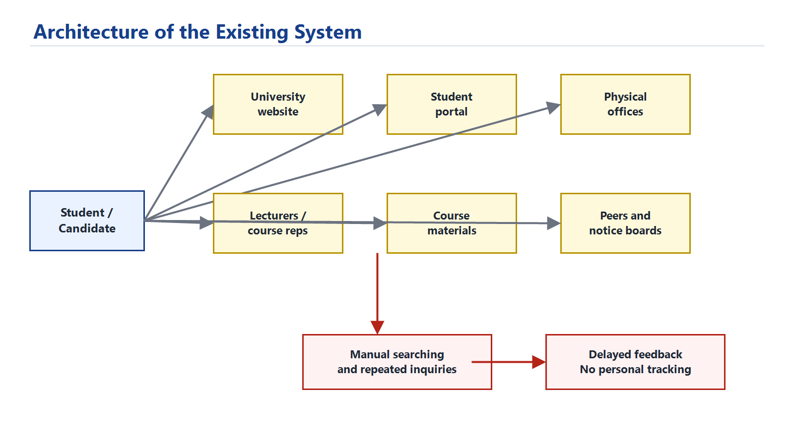

## 3.4 Proposed System Overview

The proposed system, Eve, is an AI-powered academic support platform for Edo State University Iyamho. It provides personalized learning and academic progress tracking through three major user modes:

- Guest Mode: for prospective candidates and public users.
- Student Mode: for current students who need personalized academic support.
- Lecturer Mode: for academic staff who need assigned-course analytics.

Eve combines structured academic data, curated university knowledge, RAG, cybersecurity guardrails, optional OpenAI response generation, and a responsive Flutter interface.

The major modules are:

- user role selection and account switching;
- AI chat assistant;
- RAG knowledge retrieval;
- prompt-injection and privacy guardrails;
- admissions readiness estimator;
- student learning profile;
- guided learning sessions;
- quiz scoring and feedback;
- SQLite progress persistence;
- lecturer assigned-course analytics;
- upload-assisted Ask Eve questions;
- moderated peer-note submissions;
- lecturer and admin review workflow;
- defense-ready audit and explainability labels.

## 3.5 System Requirements

### 3.5.1 Functional Requirements

The system should:

- allow users to enter as guest, student, or lecturer;
- answer general ESUI questions using curated knowledge;
- estimate admission readiness using JAMB score and O-Level grades;
- provide students with personalized academic progress information;
- identify weak courses and weak topics;
- recommend weekly study tasks;
- start guided learning sessions for registered student courses;
- explain selected topics and provide worked examples;
- score student quiz answers and provide feedback;
- persist learning sessions, answers, scores, and completion status;
- show saved student progress history;
- allow students to upload notes for private question context;
- allow students to submit course notes for review;
- allow lecturers to review peer notes only for assigned courses;
- allow administrators to manage wider knowledge-base entries;
- provide lecturers with analytics for assigned courses only;
- show lecturer trends from saved learning sessions;
- block prompt-injection attempts and unauthorized private-record requests;
- show audit information such as response mode and retrieved sources.

### 3.5.2 Non-Functional Requirements

The system should:

- be responsive on desktop and mobile screens;
- protect private student and lecturer data through role-based access;
- provide understandable and useful responses;
- remain usable when OpenAI mode is unavailable by falling back to local logic;
- run locally for defense demonstration;
- use maintainable modular backend code;
- avoid exposing API keys or hidden system instructions;
- provide clear testable API endpoints.

### 3.5.3 Hardware Requirements

- Laptop or desktop computer.
- Minimum 8GB RAM recommended.
- Internet connection when OpenAI response generation is enabled.
- Android device or browser for user testing.

### 3.5.4 Software Requirements

- Windows operating system.
- Flutter SDK.
- Python 3.
- FastAPI backend.
- Uvicorn ASGI server.
- SQLite database.
- Browser for Flutter web demonstration.
- Optional OpenAI API key.

## 3.6 Data Collection Methods

The prototype uses the following data sources:

- project requirement description supplied by the student;
- curated public information from Edo State University web resources and approved institutional documents;
- sample student records for demonstration;
- sample lecturer course analytics;
- sample ESUI knowledge base entries;
- related work on RAG, AI risk management, LLMs, and university AI platforms from 2020 onward.

The sample records are not live university records. They are used only to demonstrate system behavior, role separation, and academic progress tracking. In a production deployment, the primary knowledge source should be an approved ESUI knowledge base maintained by designated university data owners, while the public website should remain a supplementary source for current announcements and public-facing updates.

## 3.7 Population and Sampling

The intended population includes prospective candidates, current students, lecturers, and university support staff. For prototype demonstration, purposive sampling was used. Demo accounts were created to represent:

- one guest user;
- two student users;
- two lecturer users.

This sampling approach is acceptable for a system-development project because the focus is on demonstrating functionality rather than conducting a statistical survey.

## 3.8 System Architecture / Design

The system uses a client-server architecture. The Flutter client handles the user interface, while the FastAPI backend handles AI orchestration, retrieval, guardrails, academic logic, progress storage, and external AI calls.

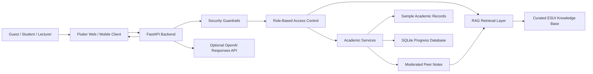

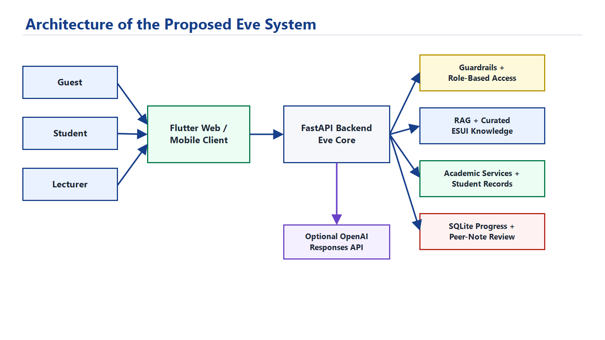

### 3.8.1 Backend Layer

The backend is implemented with FastAPI. It exposes REST endpoints for users, chat, admissions estimation, student learning profile, learning sessions, progress history, lecturer insights, file-assisted questions, peer-note submission, and moderation review.

### 3.8.2 AI Orchestration Layer

The AI layer detects user intent, checks authorization, retrieves relevant knowledge, prepares authorized private context, and generates an answer. When OpenAI is configured, Eve uses the OpenAI Responses API. When OpenAI is unavailable, Eve uses deterministic local fallback responses.

### 3.8.3 Data Layer

The prototype uses JSON files for sample users, sample academic records, and curated knowledge. It uses SQLite for saved learning sessions, progress tracking, and moderated peer-note records.

## 3.9 Use Case / UML Diagrams

### 3.9.1 Use Case Diagram

```mermaid
flowchart TB
    Guest["Guest User"]
    Student["Student"]
    Lecturer["Lecturer"]
    Eve["Eve AI System"]

    Guest --> UC1["Ask public ESUI questions"]
    Guest --> UC2["Estimate admission readiness"]
    Guest --> UC3["View admission roadmap"]

    Student --> UC4["Ask academic questions"]
    Student --> UC5["View learning progress"]
    Student --> UC6["Start guided learning session"]
    Student --> UC7["Submit quiz answers"]
    Student --> UC8["View saved progress history"]
    Student --> UC9["Ask fee or timetable guidance"]
    Student --> UC10["Upload private notes for Ask Eve"]
    Student --> UC11["Submit peer learning notes"]

    Lecturer --> UC12["View assigned-course analytics"]
    Lecturer --> UC13["View saved session trends"]
    Lecturer --> UC14["Request teaching interventions"]
    Lecturer --> UC15["Review assigned-course peer notes"]

    UC1 --> Eve
    UC2 --> Eve
    UC3 --> Eve
    UC4 --> Eve
    UC5 --> Eve
    UC6 --> Eve
    UC7 --> Eve
    UC8 --> Eve
    UC9 --> Eve
    UC10 --> Eve
    UC11 --> Eve
    UC12 --> Eve
    UC13 --> Eve
    UC14 --> Eve
    UC15 --> Eve
```

### 3.9.2 Data Flow Diagram

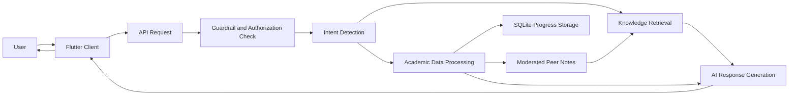

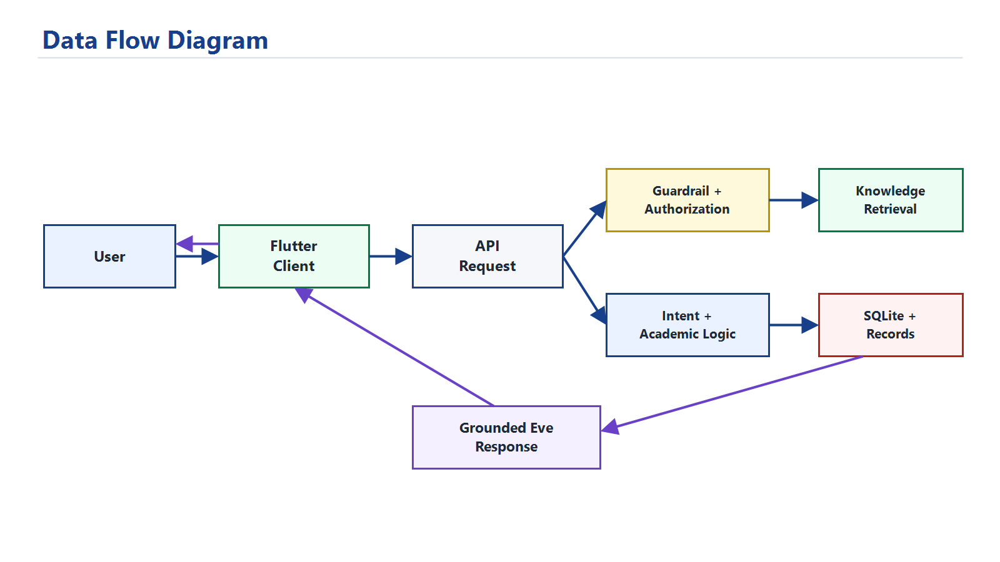

### 3.9.3 Learning Session Sequence

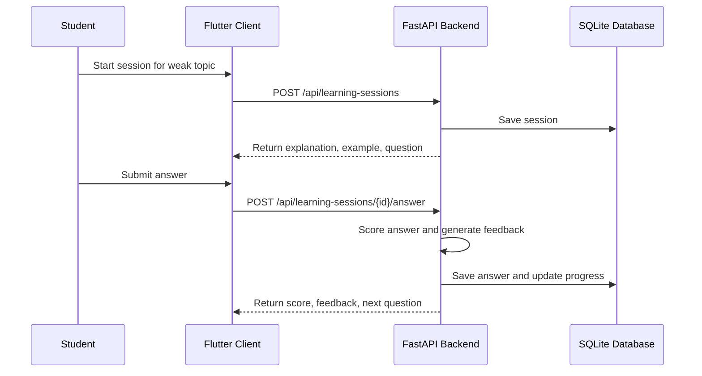

## 3.10 Database Design

SQLite is used for local persistence of learning-session history and moderated peer-note activity. This makes the prototype suitable for defense because progress and contribution records survive backend restarts without requiring an external database server.

### 3.10.1 Entity Relationship Diagram

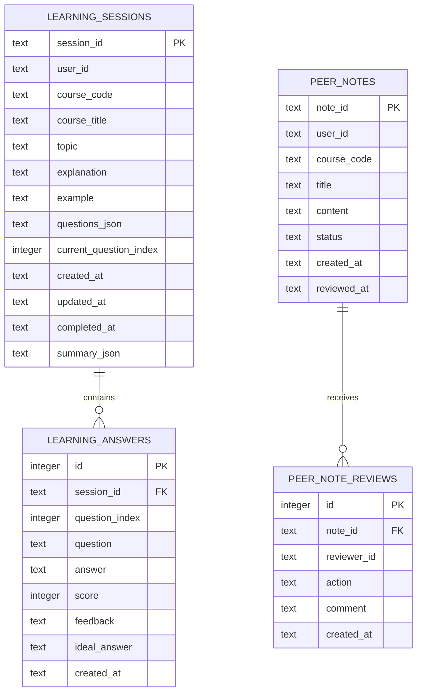

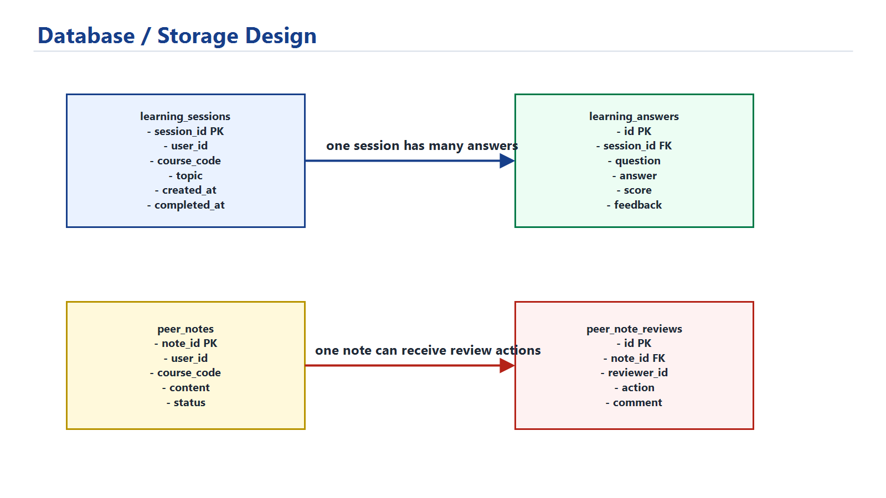

### 3.10.2 Table Description

| Table | Purpose |
| --- | --- |
| `learning_sessions` | Stores each guided learning session, course, topic, progress counter, timestamps, and summary. |
| `learning_answers` | Stores student submitted answers, scores, feedback, ideal answer direction, and timestamps. |
| `peer_notes` | Stores student course-note submissions and moderation status. |
| `peer_note_reviews` | Stores lecturer or admin review actions for submitted notes. |

The JSON sample records store demo users, student profiles, lecturer profiles, and course analytics. The SQLite database stores runtime progress history and peer-note moderation records.

## 3.11 Algorithm / Model Design

### 3.11.1 Intent Detection Algorithm

The system classifies messages into intents such as greeting, admission, exam practice, student success, fees, planning, lecturer analytics, and general knowledge. This helps Eve decide which service or retrieval path should handle the request.

### 3.11.2 RAG Algorithm

The retrieval process tokenizes the user query and compares it with curated ESUI knowledge entries. Relevant entries are returned as sources. This reduces hallucination by grounding answers in approved context.

```text
Input: user message, user role
1. Tokenize message.
2. Filter knowledge entries by allowed audience.
3. Score each entry using token overlap similarity.
4. Rank entries by score.
5. Return top relevant entries.
```

### 3.11.3 Learning Progress Algorithm

Course progress is calculated using continuous assessment score, risk level, and weak-topic count. Saved quiz averages are then used as an additional signal.

```text
course_progress = CA score + risk_bonus - topic_gap_penalty
overall_progress = weighted average of course progress and saved quiz performance
```

### 3.11.4 Quiz Scoring Algorithm

Each quiz question has expected keywords and an ideal answer. The system checks whether the student answer includes core concepts, then assigns a score and feedback.

```text
1. Normalize student answer.
2. Match expected keywords.
3. Calculate match ratio.
4. Add explanation-length bonus when appropriate.
5. Return score, feedback, and ideal direction.
```

### 3.11.5 Guardrail Algorithm

Before retrieval or answer generation, suspicious prompts are checked. Requests that attempt to reveal hidden prompts, bypass authorization, dump records, or access another user's private data are blocked.

## 3.12 Tools and Technologies

| Tool | Purpose |
| --- | --- |
| Flutter | Cross-platform client interface for Web and future Android deployment. |
| Python | Backend language suitable for AI, data processing, and RAG workflows. |
| FastAPI | REST API backend framework. |
| SQLite | Local database for saved learning-session progress. |
| OpenAI Responses API | Optional ChatGPT-style response generation. |
| JSON | Prototype knowledge and sample academic records. |
| PowerShell | Local development and testing commands. |

Flutter was selected because the product vision includes a downloadable mobile app and responsive web demonstration. Python FastAPI was selected because Python has strong support for AI, retrieval, data processing, and future machine-learning extensions.

## 3.13 Ethical Considerations

The system handles academic and personal data; therefore, privacy and responsible AI behavior are important. The prototype uses sample records, but a production system would require official data approval, authentication, consent, audit logs, and institutional governance.

Key ethical considerations include:

- protecting student academic records;
- limiting lecturers to assigned-course analytics;
- avoiding false admission guarantees;
- showing uncertainty when official context is insufficient;
- blocking prompt injection and private-record extraction;
- keeping API keys outside the application code;
- documenting AI use honestly.

## 3.14 Summary of the Chapter

This chapter described the system analysis and design of Eve. It presented the existing system, proposed architecture, requirements, use cases, database structure, algorithms, technology choices, and ethical considerations. The design supports the main goal of the project by combining personalized learning, academic progress tracking, role-based access, RAG, guardrails, and saved progress history.

# CHAPTER FOUR

# IMPLEMENTATION

## 4.1 Introduction to the Chapter

This chapter presents the implementation of the project topic: **Design and implementation of an ai system for personalized learning and academic progress tracking**. It describes the implementation environment, system modules, interface design, API endpoints, testing process, results, and discussion of findings.

The implemented system is named Eve. Eve was built as a responsive Flutter client connected to a Python FastAPI backend. The backend provides AI orchestration, RAG, role-based access control, learning-session scoring, SQLite persistence, admission readiness estimation, student progress tracking, and lecturer analytics.

## 4.2 Implementation Environment

The system was implemented and tested in the following environment:

| Item | Description |
| --- | --- |
| Operating system | Windows |
| Client framework | Flutter |
| Backend framework | FastAPI |
| Backend language | Python |
| Local database | SQLite |
| API server | Uvicorn |
| AI response mode | Optional OpenAI Responses API with local fallback |
| Browser test URL | `http://127.0.0.1:8011` |
| Backend test URL | `http://127.0.0.1:8010` |

The local backend is started with:

```powershell
python -m uvicorn api.eve_core.main:app --host 127.0.0.1 --port 8010 --reload
```

The Flutter web client is started with:

```powershell
cd eve_app
flutter run -d web-server --web-hostname 127.0.0.1 --web-port 8011
```

## 4.3 System Implementation

### 4.3.1 Backend Implementation

The backend was implemented using FastAPI. It is organized into modules for admissions, AI assistance, learning profiles, learning sessions, persistence, retrieval, repository access, schemas, and security.

Major backend files include:

| File | Purpose |
| --- | --- |
| `api/eve_core/main.py` | Defines API routes and application setup. |
| `api/eve_core/assistant.py` | Handles intent detection, authorization, retrieval, and answer generation. |
| `api/eve_core/learning.py` | Computes student learning profile and progress dashboard data. |
| `api/eve_core/learning_sessions.py` | Starts guided sessions, scores answers, and returns feedback. |
| `api/eve_core/progress_store.py` | Stores and retrieves SQLite learning-session history. |
| `api/eve_core/retrieval.py` | Implements RAG-style knowledge retrieval. |
| `api/eve_core/security.py` | Blocks prompt injection and unauthorized private-record access. |
| `api/eve_core/llm.py` | Connects to optional OpenAI response generation. |

### 4.3.2 Frontend Implementation

The frontend was implemented using Flutter. It provides a responsive interface for guest, student, and lecturer users. The interface includes login mode selection, chat, tools, admissions estimator, student learning progress dashboard, guided learning session screen, upload-assisted Ask Eve, peer-note contribution, lecturer workbench, knowledge governance views, and profile/account switcher.

Major frontend files include:

| File | Purpose |
| --- | --- |
| `eve_app/lib/main.dart` | Main Flutter interface and screens. |
| `eve_app/lib/eve_api.dart` | API client for backend communication. |
| `eve_app/lib/eve_models.dart` | Data models for users and chat responses. |

### 4.3.3 RAG and AI Response Implementation

The system uses a curated ESUI knowledge base. When a user asks a knowledge-based question, Eve retrieves relevant entries according to the user's role. The retrieved information is used to ground the answer. If OpenAI is configured, Eve uses the OpenAI Responses API to make the answer more natural while respecting the authorized context. If OpenAI is not configured, Eve returns a local fallback answer.

### 4.3.4 Prompt-Injection Guardrail Implementation

Before answering a request, Eve checks whether the prompt attempts to bypass rules, reveal hidden instructions, extract private records, or impersonate another user. Suspicious requests are blocked before retrieval or generation.

### 4.3.5 Personalized Learning Implementation

The personalized learning module computes:

- overall progress;
- learning status;
- weak topics;
- priority course;
- weekly learning plan;
- milestones;
- saved session history;
- quiz average;
- course-level session statistics.

For the demo student `stu-csc-001`, Eve identifies `MTH 211` as a priority course because it has a high risk level and topic gaps such as eigenvalues and matrix inverse.

### 4.3.6 Guided Learning Session Implementation

A student can start a guided learning session from a weak course. Eve returns a concept explanation, worked example, and practice questions. The student submits answers, and the backend scores them using expected concepts and keywords. The answer, score, feedback, and ideal answer direction are saved in SQLite.

### 4.3.7 Lecturer Analytics Implementation

Lecturers can view analytics only for their assigned courses. The lecturer workbench shows:

- assigned course count;
- tracked students;
- completed Eve learning sessions;
- average quiz score;
- topic performance;
- weakest saved topic;
- intervention recommendation.

For example, `lec-mth-002` can view `MTH 211` insights because the course is assigned to that lecturer.

### 4.3.8 Upload-Assisted Ask Eve Implementation

The Ask Eve module supports file-assisted academic questions. A student can upload a supported note file and ask Eve to summarize, explain, or turn the content into a study plan. This makes the assistant more useful for personalized learning because it can respond to a student's own learning material instead of only answering from general knowledge.

For the prototype, uploaded content is treated as private session context. Eve uses it to support the student's current question, but it is not automatically published to the shared knowledge base. This design prevents unverified notes from becoming official institutional content.

### 4.3.9 Moderated Peer Notes and Knowledge Governance Implementation

The project also includes a moderated peer-note workflow. Students can submit helpful course notes, summaries, and explanations, but those notes do not become shared learning material until they are reviewed. Lecturers can review submissions only for courses assigned to them, while administrators can review wider institutional knowledge entries.

The moderation process supports three outcomes:

- approve useful and accurate notes;
- request revision when a note needs correction;
- reject unsuitable or inaccurate notes.

Approved peer notes can be retrieved as learning support, while pending and rejected notes remain separate from the official knowledge base. This protects students from misinformation and supports academic governance.

## 4.4 System Interface / Screenshots

The following screenshots were captured from the running system and are included as implementation evidence:

| Figure | Screenshot | Description |
| --- | --- | --- |
| Figure 4.1 | Entry screen | Shows guest, student, and lecturer entry modes. |
| Figure 4.2 | Personalized student dashboard | Shows today's focus, weak topic, progress, and peer-note activity. |
| Figure 4.3 | Mobile responsive dashboard | Shows the same student dashboard adapted to a phone screen. |
| Figure 4.4 | Ask Eve conversation | Shows Eve giving personalized academic guidance. |
| Figure 4.5 | Upload-assisted Ask Eve | Shows Eve using an uploaded CSC note to support a student's question. |
| Figure 4.6 | Guided learning session | Shows concept explanation and practice question support. |
| Figure 4.7 | Peer-note submission | Shows the student contribution form. |
| Figure 4.8 | Lecturer peer-note review | Shows approve, reject, and revise moderation actions. |
| Figure 4.9 | Lecturer analytics | Shows assigned-course analytics and intervention insight. |
| Figure 4.10 | Admission readiness estimator | Shows public guidance for Computer Science admission readiness. |
| Figure 4.11 | Admin knowledge library | Shows curated institutional knowledge entries and governance controls. |
| Figure 4.12 | Backend health endpoint | Shows the deployed backend running in OpenAI Responses API mode. |

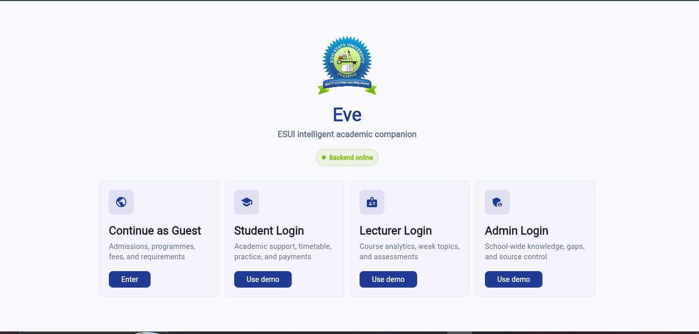

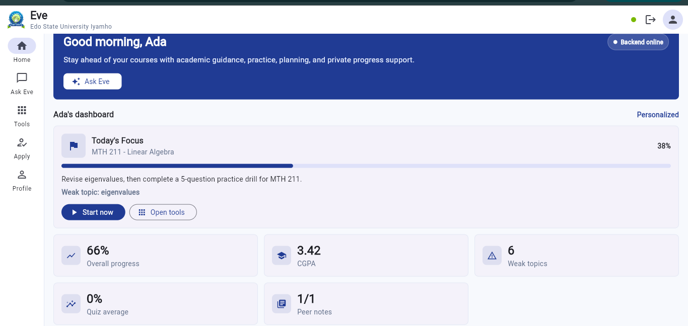

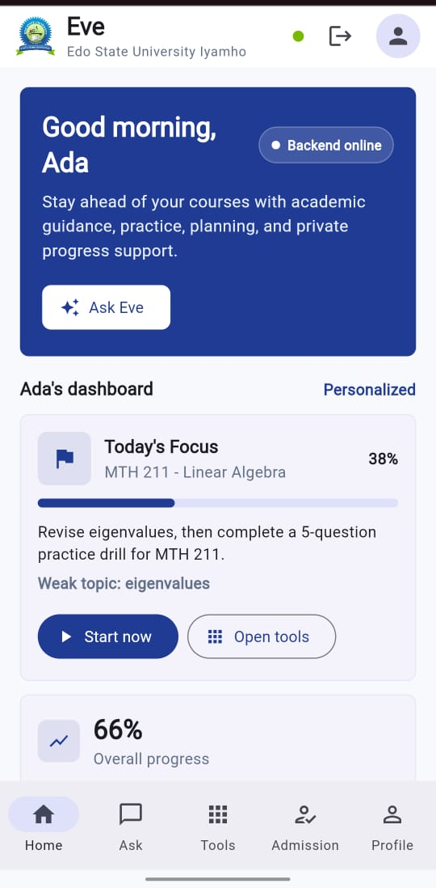

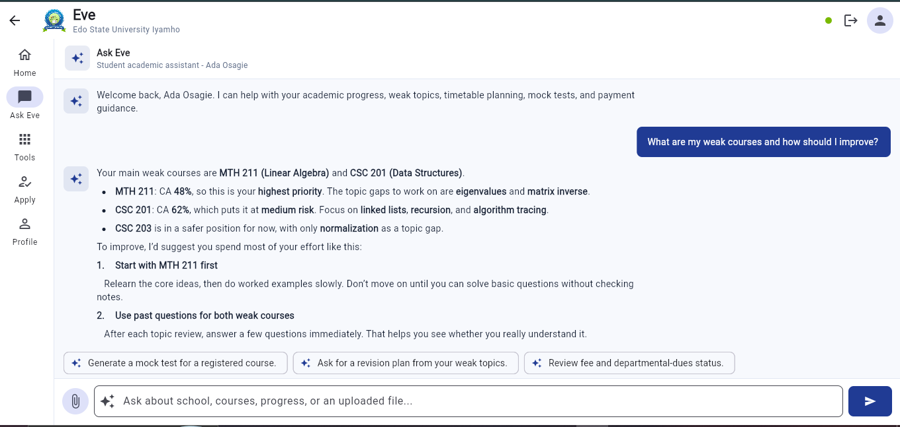

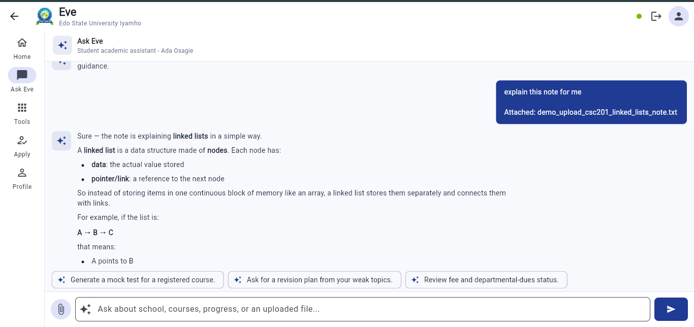

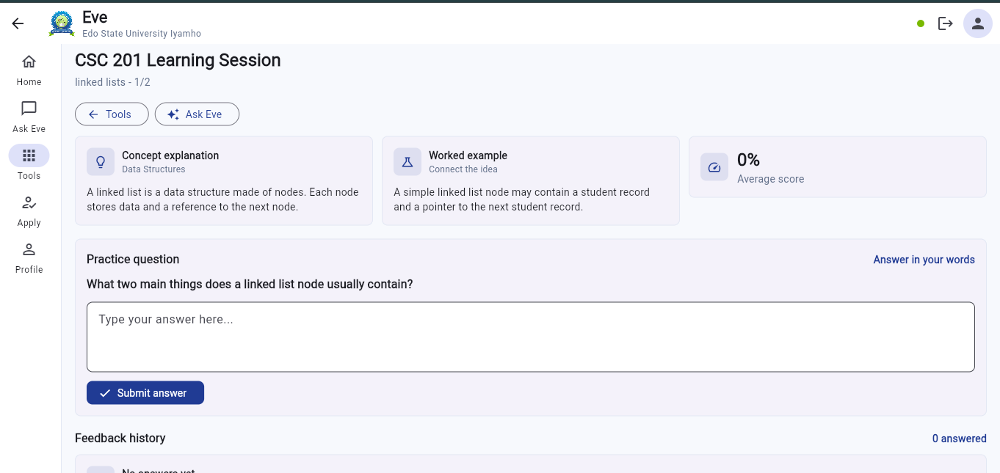

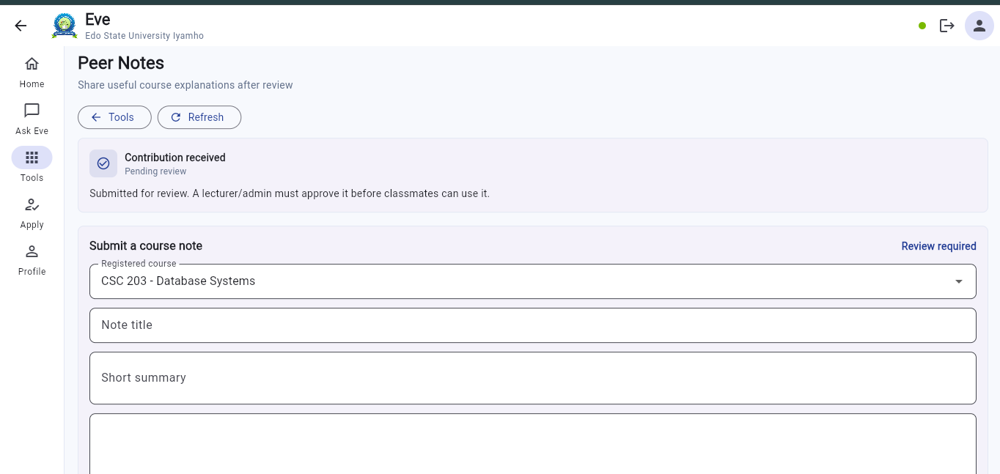

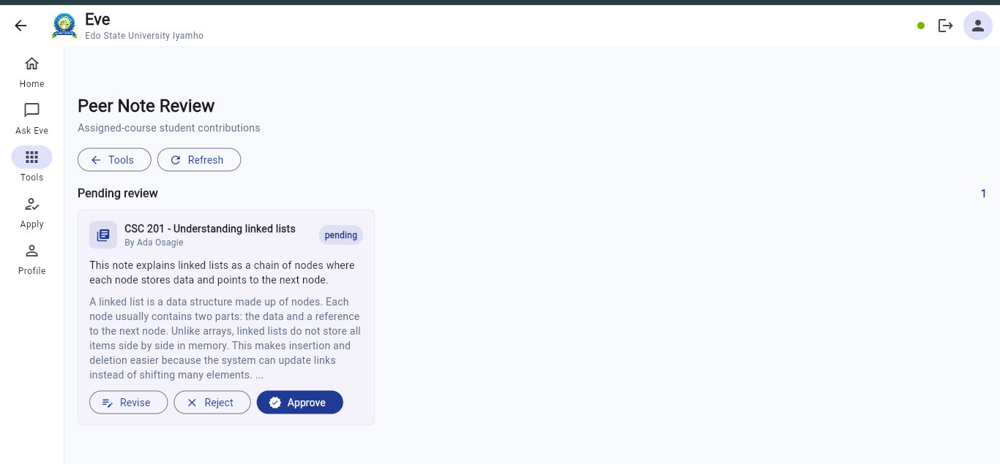

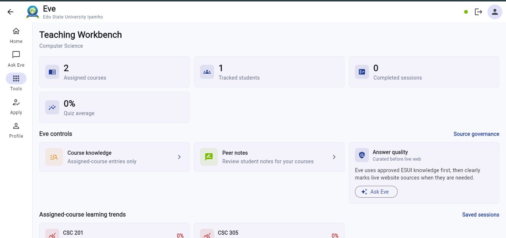

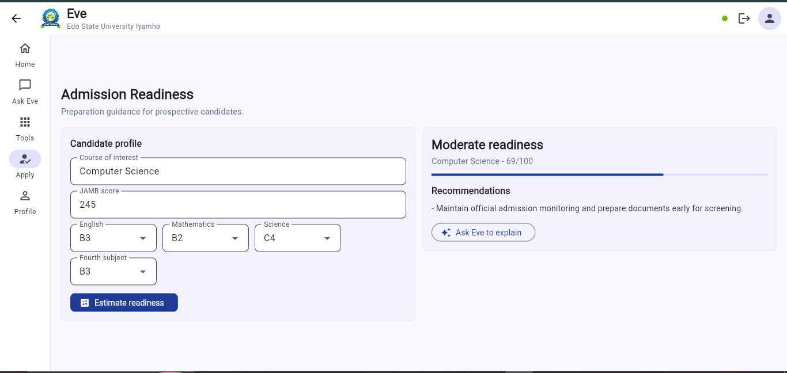

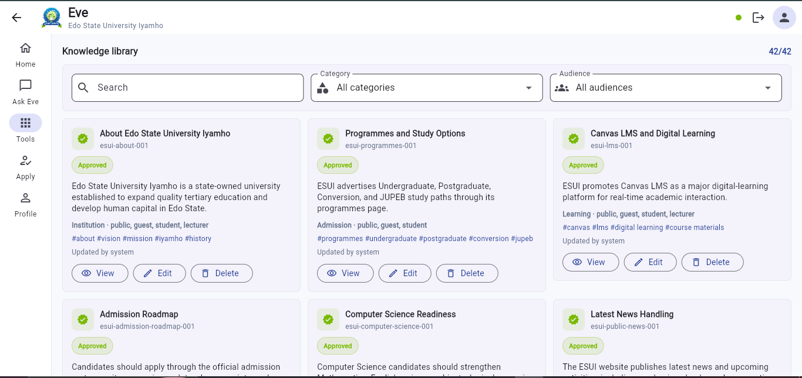

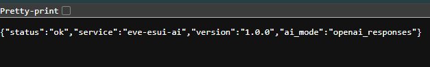

## 4.5 Test Plan

The system was tested using functional tests, API endpoint tests, UI tests, and security behavior checks.

| Test Area | Purpose |
| --- | --- |
| Backend compilation | Confirm Python modules compile successfully. |
| Flutter analysis | Detect Dart and Flutter code issues. |
| Flutter widget test | Confirm the app renders the entry screen. |
| API health test | Confirm backend service is running. |
| Student learning profile test | Confirm personalized progress data is returned. |
| Learning session test | Confirm session creation, answer scoring, and persistence. |
| Lecturer insight test | Confirm assigned-course analytics and saved learning trends. |
| Chat test | Confirm natural responses and role-aware answers. |
| Guardrail test | Confirm prompt-injection attempts are blocked. |
| Upload-assisted chat test | Confirm Eve can use an uploaded note as private question context. |
| Peer-note moderation test | Confirm student notes require review before shared use. |
| Knowledge governance test | Confirm admin knowledge entries and audit labels are available. |

## 4.6 Test Cases and Test Results

### 4.6.1 Backend Compilation Test

| Test | Command | Expected Result | Actual Result |
| --- | --- | --- | --- |
| Compile backend | `python -m compileall -q api` | No syntax errors | Passed |

### 4.6.2 Flutter Analysis Test

| Test | Command | Expected Result | Actual Result |
| --- | --- | --- | --- |
| Analyze Flutter app | `flutter analyze` | No issues found | Passed |

### 4.6.3 Flutter Widget Test

| Test | Command | Expected Result | Actual Result |
| --- | --- | --- | --- |
| Render entry screen | `flutter test` | All tests passed | Passed |

### 4.6.4 API Health Test

| Endpoint | Expected Result | Actual Result |
| --- | --- | --- |
| `GET /api/health` | Backend status is `ok` | Passed |

Example response:

```json
{
  "status": "ok",
  "service": "eve-esui-ai",
  "version": "1.0.0",
  "ai_mode": "openai_responses"
}
```

### 4.6.5 Student Learning Profile Test

| Endpoint | Expected Result | Actual Result |
| --- | --- | --- |
| `GET /api/student/stu-csc-001/learning-profile` | Return personalized learning profile | Passed |

The response includes overall progress, weak topics, priority course, weekly plan, saved session history, completed sessions, and quiz average.

### 4.6.6 Learning Session Persistence Test

| Endpoint | Expected Result | Actual Result |
| --- | --- | --- |
| `POST /api/learning-sessions` | Create guided learning session | Passed |
| `POST /api/learning-sessions/{session_id}/answer` | Score answer and save feedback | Passed |
| `GET /api/student/stu-csc-001/progress-history` | Return saved SQLite progress history | Passed |

One demo `MTH 211` eigenvalues session returned a saved average score of `93%`.

### 4.6.7 Lecturer Analytics Test

| Endpoint | Expected Result | Actual Result |
| --- | --- | --- |
| `GET /api/lecturer/lec-mth-002/insights` | Return assigned-course trends for `MTH 211` | Passed |

The response includes total sessions, completed sessions, tracked student count, average quiz score, topic performance, weakest saved topic, and an intervention suggestion.

### 4.6.8 Chat Response Test

| Input | Expected Result | Actual Result |
| --- | --- | --- |
| `hello` | Natural greeting response | Passed |
| `how are you` | Natural check-in response | Passed |
| `Show lecturer analytics for MTH 211` | Lecturer analytics with saved session trends | Passed |

### 4.6.9 Security Test

| Test | Expected Result | Actual Result |
| --- | --- | --- |
| Prompt-injection attempt | Request should be blocked | Passed |
| Student tries to access another student's private record | Request should be denied | Passed |
| Lecturer requests unassigned course analytics | Access should be denied | Passed |

### 4.6.10 Upload-Assisted Ask Eve Test

| Test | Expected Result | Actual Result |
| --- | --- | --- |
| Upload a CSC note and ask Eve for explanation | Eve should use the uploaded note as context for the current question | Passed |

### 4.6.11 Peer-Note Moderation Test

| Test | Expected Result | Actual Result |
| --- | --- | --- |
| Student submits course note | Note should appear as pending review | Passed |
| Lecturer reviews assigned-course note | Lecturer should approve, reject, or request revision | Passed |
| Approved note is retrieved by Eve | Approved note should be available as reviewed peer learning context | Passed |

### 4.6.12 Knowledge Governance Test

| Test | Expected Result | Actual Result |
| --- | --- | --- |
| Admin adds knowledge entry | Entry should be saved with governance metadata | Passed |
| Ask Eve about knowledge gaps | Eve should explain uncertainty and avoid unsupported claims | Passed |

## 4.7 Model Training and Evaluation

The prototype does not train a new large language model from scratch. Instead, it uses:

- a curated ESUI knowledge base;
- deterministic local academic logic;
- RAG-style retrieval;
- optional OpenAI response generation;
- scoring logic for guided learning sessions.

This approach is appropriate for the prototype because training a large model would require large datasets, high computing resources, and institutional governance. RAG allows the system to use verified knowledge while reducing hallucination.

Evaluation was performed through functional testing, response quality checks, role-based access tests, and guardrail tests.

## 4.8 Experimental Results and Analysis

The implemented prototype successfully demonstrated the main project goal. It was able to:

- support role-based guest, student, and lecturer modes;
- provide public ESUI guidance;
- estimate admission readiness;
- identify student weak topics;
- recommend personalized study tasks;
- start guided learning sessions;
- score quiz answers;
- store learning progress in SQLite;
- show saved progress history;
- provide lecturer course-level learning trends;
- support upload-assisted questions using student-provided notes;
- allow moderated peer-note contribution and lecturer review;
- provide admin knowledge governance for curated information;
- generate natural AI responses when OpenAI mode is configured;
- block unsafe or unauthorized requests.

The saved `MTH 211` session showed how a student's activity can become progress evidence. The lecturer dashboard then reused that saved learning history as course-level teaching insight.

## 4.9 Performance Evaluation

The system ran successfully in a local development environment. Flutter web returned HTTP `200` on `http://127.0.0.1:8011`, and the backend responded on `http://127.0.0.1:8010`.

The system uses lightweight JSON and SQLite storage, which is suitable for prototype demonstration. In production, performance can be improved by using a managed database, caching, vector search, asynchronous workers, and institution-hosted infrastructure.

## 4.10 Discussion of Results

The results show that Eve is more than a chatbot. It implements the core requirements of personalized learning and academic progress tracking. The student module identifies weak topics and tracks improvement through saved quiz sessions. The lecturer module converts saved student learning activity into course-level intervention insight. The guest module supports admissions and public inquiry functions.

The use of guardrails and role-based access control addresses privacy and cybersecurity concerns. The OpenAI integration improves response quality, while local fallback logic ensures that the system can still operate when external AI access is unavailable.

The prototype is limited by its use of sample data. However, its architecture can be extended to real university systems through secure APIs, identity management, approved course materials, and managed database storage.

## 4.11 Summary of the Chapter

This chapter presented the implementation and testing of Eve. It described the development environment, backend and frontend modules, interface screens, test plan, test results, AI evaluation approach, and discussion of results. The implementation confirms that the project topic was achieved through a working system for personalized learning, academic progress tracking, guided learning sessions, upload-assisted learning support, moderated peer notes, knowledge governance, and lecturer analytics.

# CHAPTER FIVE

# SUMMARY, CONCLUSION AND RECOMMENDATIONS

## 5.1 Introduction to the Chapter

This chapter presents the summary, conclusion, recommendations, limitations, future work, and AI-use disclosure for the project topic: **Design and implementation of an ai system for personalized learning and academic progress tracking**.

The chapter reviews what was achieved in the study and explains how the implemented system addresses the identified problem.

## 5.2 Summary of the Study

The study focused on the design and implementation of an AI system that supports personalized learning and academic progress tracking for Edo State University Iyamho. The system, named Eve, was developed as a role-aware academic companion for prospective candidates, current students, and lecturers.

The project began with the problem that academic guidance, course support, admission information, and progress tracking are often spread across different sources. Students may need support with weak topics, study planning, mock tests, and academic improvement, while lecturers may need course-level insights for teaching intervention. Generic AI chatbots are not sufficient because they may lack institutional grounding, privacy controls, and role-based access.

To address the problem, Eve was built with a Flutter frontend and a Python FastAPI backend. The backend includes RAG retrieval, prompt-injection guardrails, role-based access control, student learning-profile computation, guided learning sessions, quiz scoring, SQLite progress persistence, lecturer assigned-course analytics, admission readiness estimation, upload-assisted questions, moderated peer-note contribution, knowledge governance, and optional OpenAI response generation.

The implemented system demonstrates that AI can be used as an institutional academic-support layer when combined with verified knowledge, structured academic data, saved progress history, and privacy-aware controls.

## 5.3 Achievement of Objectives

The project objectives were achieved as follows:

| Objective | Achievement |
| --- | --- |
| Design a responsive AI system interface | A Flutter web/mobile interface was implemented with guest, student, lecturer, chat, tools, admission, and profile screens. |
| Implement personalized academic support for students | The student module analyzes course records, weak topics, risk levels, timetable data, and saved quiz performance. |
| Implement academic progress tracking | Eve tracks overall progress, priority course, weak topics, completed learning sessions, quiz scores, and feedback history. |
| Generate personalized learning plans | The system recommends weekly learning tasks, priority-course sessions, and study milestones. |
| Implement RAG with ESUI knowledge | The backend retrieves from a curated ESUI knowledge base and grounds public responses in approved context. |
| Implement role-based access control | Guests, students, and lecturers receive different authorized data access. |
| Add cybersecurity guardrails | Prompt injection, private-record extraction, and unauthorized requests are blocked. |
| Provide student academic advising and mock assessment support | Eve supports course explanations, mock questions, guided sessions, scoring, and feedback. |
| Provide lecturer analytics | Lecturers can view assigned-course analytics and saved learning-session trends. |
| Include admission readiness guidance | The guest module includes a readiness estimator based on JAMB and O-Level details. |
| Support student learning-material uploads | Students can upload notes for private Ask Eve context during a learning conversation. |
| Support peer learning with moderation | Students can submit course notes, while lecturers or administrators review them before shared use. |
| Support knowledge governance | Admin knowledge tools and audit-style labels help separate curated knowledge from unverified content. |
| Evaluate the system | Backend, Flutter, API, learning-session, lecturer, and security tests were performed. |

## 5.4 Contributions to Knowledge/Practice

This project contributes to academic practice in the following ways:

- It demonstrates how AI can be used for personalized learning and academic progress tracking in a university context.
- It shows how RAG can reduce hallucination by grounding answers in curated institutional knowledge.
- It demonstrates the importance of role-based access control in academic AI systems.
- It provides a model for saving learning-session history and using it as progress evidence.
- It extends academic support beyond students by giving lecturers course-level learning trends.
- It demonstrates a moderated peer-learning workflow where student contributions are reviewed before being reused.
- It shows how uploaded notes can support a student's private learning question without polluting the shared knowledge base.
- It shows how prompt-injection guardrails can be included in an educational AI prototype.
- It provides a practical foundation for a future ESUI institutional AI platform.

## 5.5 Conclusion

The project successfully achieved its aim of designing and implementing an AI system for personalized learning and academic progress tracking. Eve provides a working prototype that supports guests, students, and lecturers through role-based AI assistance.

The student module identifies weak topics, recommends study tasks, starts guided learning sessions, scores answers, provides feedback, saves progress history, and supports note-assisted questions. The lecturer module provides assigned-course analytics, uses saved learning-session data to suggest teaching interventions, and reviews peer notes for assigned courses. The guest module supports admissions guidance and public inquiries. The system also includes RAG, OpenAI response generation, local fallback logic, prompt-injection guardrails, knowledge governance, and SQLite persistence.

The results show that Eve is more than a general chatbot. It is a structured academic-support system that combines AI conversation, institutional knowledge, academic records, learning analytics, and security controls.

## 5.6 Limitations of the Study

The study has the following limitations:

- The prototype uses sample student and lecturer records, not live ESUI records.
- The ESUI knowledge base is curated for demonstration and does not yet include all departments.
- The SQLite database is suitable for local demonstration but should be replaced with managed production storage.
- The system does not yet connect to Canvas LMS, official payment systems, or student information systems.
- The guided quiz scoring uses keyword-based logic and should be improved with richer assessment methods in production.
- The peer-note workflow uses prototype moderation records and should be connected to official lecturer accounts before production use.
- Uploaded files are used for demonstration and should be scanned, stored, and governed with stronger institutional controls in production.
- OpenAI response quality depends on API availability and configuration.
- The system has not yet been evaluated with a large group of real ESUI students and lecturers.

## 5.7 Recommendations

Based on the study, the following recommendations are made:

- Edo State University should consider a governed institutional AI assistant for academic support.
- Official data owners should review and approve knowledge content before production deployment.
- The system should be integrated with secure university authentication.
- Student records should only be accessed through approved APIs and role-based permissions.
- Lecturers should be given analytics only for assigned courses.
- Course materials should be added through lecturer-approved LMS integration.
- Peer-learning submissions should remain hidden from general use until approved by authorized lecturers or administrators.
- AI outputs should include source grounding, uncertainty handling, and audit logs.
- The system should be tested with real users before deployment.

## 5.8 Suggestions for Future Work

Future work may include:

- integration with ESUI student information systems;
- integration with Canvas LMS course materials;
- managed database deployment using PostgreSQL or another production database;
- vector database support using pgvector, Qdrant, or Chroma;
- lecturer content-upload and approval dashboard;
- push notifications for study reminders and academic nudges;
- richer quiz generation and grading using lecturer-approved marking schemes;
- mobile Android release through Google Play Store;
- real-time human handoff to admissions, finance, or academic advising units;
- institutional analytics dashboard for administrators;
- evaluation with real student and lecturer participants.

## 5.9 AI Use Disclosure

AI tools were used to support the planning, drafting, coding, debugging, and documentation of this project. The final project remains the student's responsibility. All AI-assisted content should be reviewed, edited, and verified by the student before submission. Sensitive information such as API keys, private student data, and institutional credentials should not be placed in public documents or shared chats.

The implemented system also uses optional AI response generation through an API key stored locally in a private `.env` file. The project does not hard-code or publicly expose the API key.

# References From 2020 Forward

1. Lewis, P., Perez, E., Piktus, A., Petroni, F., Karpukhin, V., Goyal, N., Kuttler, H., Lewis, M., Yih, W., Rocktaschel, T., Riedel, S., & Kiela, D. (2020). Retrieval-Augmented Generation for Knowledge-Intensive NLP Tasks. arXiv. https://arxiv.org/abs/2005.11401

2. National Institute of Standards and Technology. (2023). Artificial Intelligence Risk Management Framework (AI RMF 1.0). https://www.nist.gov/publications/artificial-intelligence-risk-management-framework-ai-rmf-10

3. Zhao, W. X., Zhou, K., Li, J., Tang, T., Wang, X., Hou, Y., Min, Y., Zhang, B., Zhang, J., Dong, Z., Du, Y., Yang, C., Chen, Y., Chen, Z., Jiang, J., Ren, R., Li, Y., Tang, X., Liu, Z., Liu, P., Nie, J., & Wen, J. (2023). A Survey of Large Language Models. arXiv. https://arxiv.org/abs/2303.18223

4. ISO/IEC. (2023). ISO/IEC 42001:2023 Artificial intelligence management system. https://www.iso.org/standard/42001

5. Gao, Y., Xiong, Y., Gao, X., Jia, K., Pan, J., Bi, Y., Dai, Y., Sun, J., Wang, M., & Wang, H. (2024). Retrieval-Augmented Generation for Large Language Models: A Survey. arXiv. https://arxiv.org/abs/2312.10997

6. OWASP Foundation. (2025). OWASP Top 10 for Large Language Model Applications. https://owasp.org/www-project-top-10-for-large-language-model-applications

7. Arizona State University. (2026). ChatGPT Edu. https://ai.asu.edu/chatgpt-edu

8. University of Michigan Information and Technology Services. (2026). ITS AI Services. https://its.umich.edu/computing/ai

9. University of Michigan Information and Technology Services. (2026). Go Blue: Mobile AI at U-M. https://its.umich.edu/computing/ai/go-blue-ai

10. Georgia State University. (2022). Classroom Chatbot Improves Student Performance, Study Says. https://news.gsu.edu/2022/03/21/classroom-chatbot-improves-student-performance-study-says/

11. University of Houston. (2025). Shasta Chatbot: Ready to Answer Your Online Questions. https://www.uh.edu/af/news/press-releases/releases-articles/2025/oct-25/shasta-chatbot-ready-to-answer-questions.php

12. University of Alaska Fairbanks. (2026). Ocelot AI chatbot launches. https://www.uaf.edu/news/ocelot-ai-chatbot-launches.php
